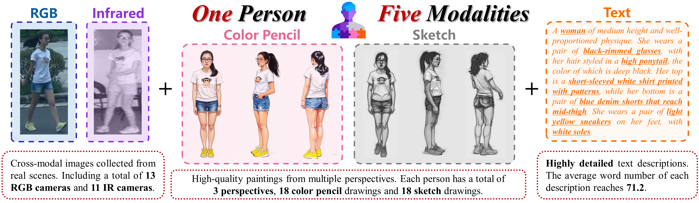

# ReID5o_ORBench
<div align="center"></div>

We investigate a new challenging problem called **Omni Multi-modal Person Re-identification** (OM-ReID), which aims to achieve effective retrieval with varying multi-modal queries. 

To address dataset scarcity, we construct **ORBench**, the first high-quality multi-modal dataset comprising 1,000 unique identities across five modalities: RGB, infrared, color pencil, sketch, and textual description. Moreover, we propose **ReID5o**, a novel multi-modal learning framework for person ReID. It enables synergistic fusion and cross-modal alignment of arbitrary modality combinations in a single model. 

More details can be found at our paper [ReID5o: Achieving Omni Multi-modal Person Re-identification in a Single Model](http://arxiv.org/abs/2506.09385).

## News
* 🔥[2025.6.13] We are hosting the **Omni-Modality Person Re-Identification Challenge** at PRCV2025 using ORBench. With generous prizes, everyone is welcome to participate!
* 🔥[2025.6.13] The paper is released at [ArXiv](http://arxiv.org/abs/2506.09385).
  
## ORBench
We are hosting the Omni-Modality Person Re-Identification Challenge at PRCV2025 using ORBench. Teams interested in participating should carefully read the competition matters on the [official website](http://2025.prcv.cn/CN/Competitions2/), fill out the registration form, sign the Data Use License Agreement in the *Licences* folder of this repository, and send both documents to prcv2025omreid@163.com to obtain the dataset download link.  

**Note:** The complete version of ORBench (the test set) will not be publicly released during the competition. Teams that are not interested in participating in the competition but are interested in ORBench can directly send the signed license agreement to the email address, and we will send the download link for the ORBench training set. **The complete version of ORBench will be released after the competition concludes** to better ensure competition fairness and promote academic research (approximately October 2025).

## ReID5o
The ReID5o code and model will be made publicly available after the paper is accepted. Stay tuned!

## Reference
If you use this work in your research, please cite it by the following BibTeX entry:
```
@misc{zuo2025reid5oachievingomnimultimodal,
      title={ReID5o: Achieving Omni Multi-modal Person Re-identification in a Single Model}, 
      author={Jialong Zuo and Yongtai Deng and Mengdan Tan and Rui Jin and Dongyue Wu and Nong Sang and Liang Pan and Changxin Gao},
      year={2025},
      eprint={2506.09385},
      archivePrefix={arXiv},
      primaryClass={cs.CV},
      url={https://arxiv.org/abs/2506.09385}, 
}
